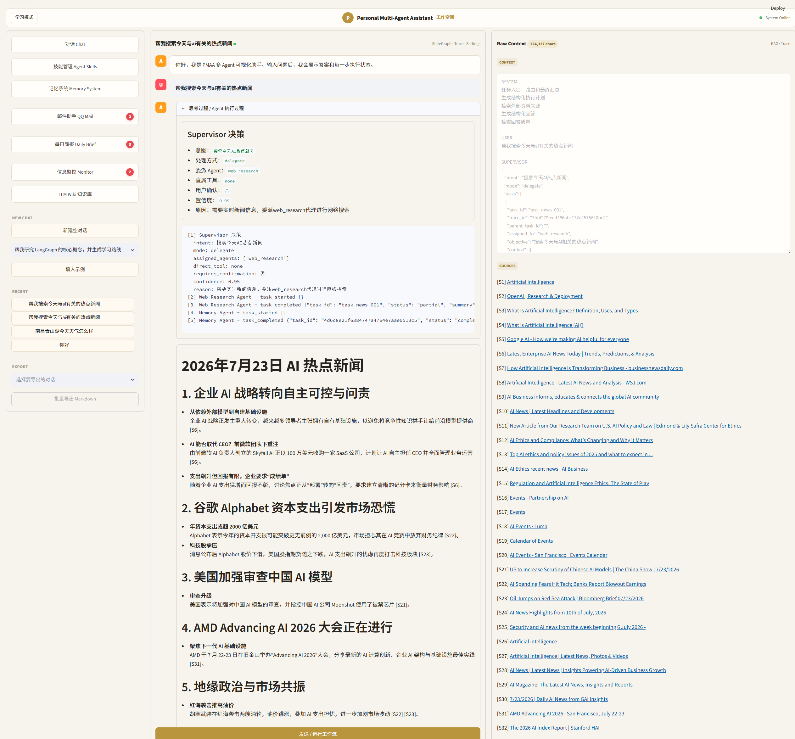
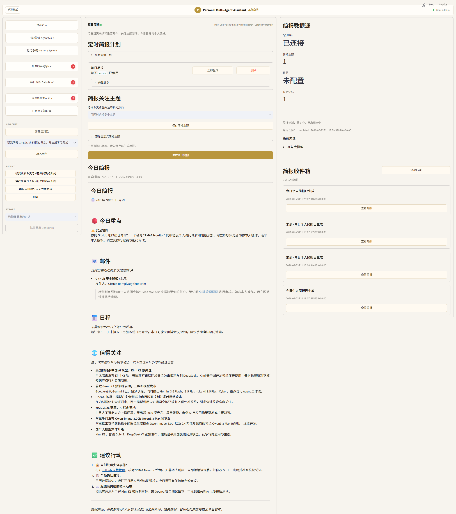
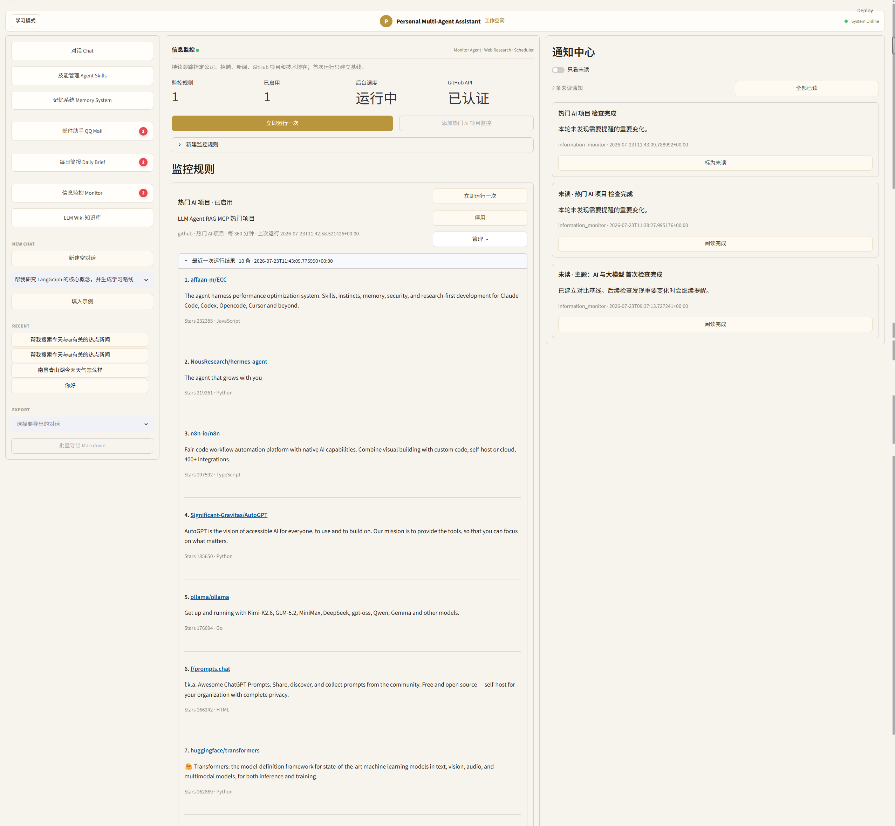
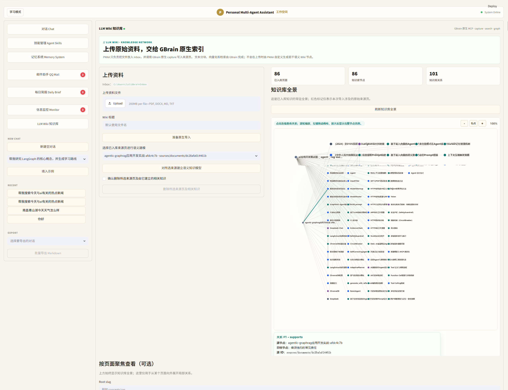
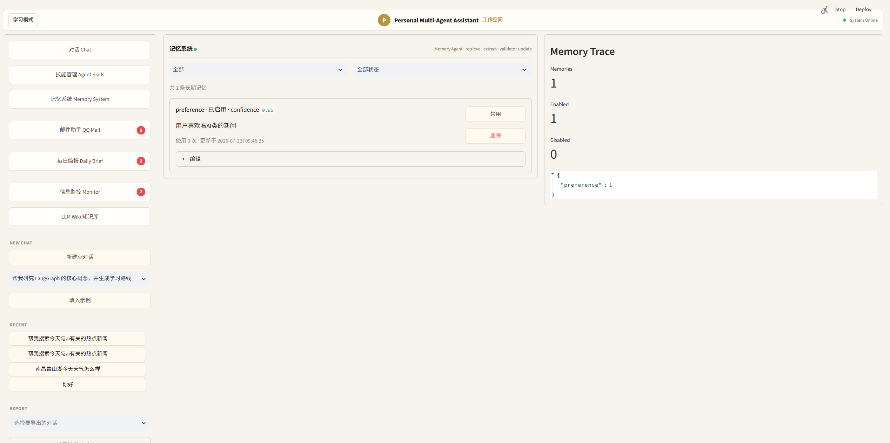
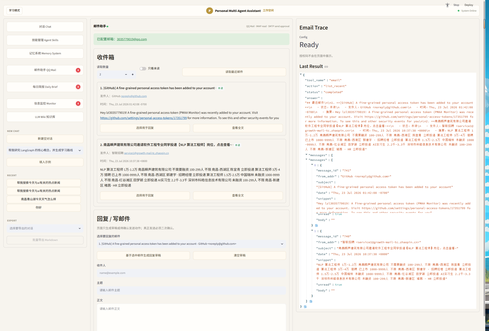

# Personal Multi-Agent Assistant (PMAA)

PMAA 是一个基于 Supervisor 层级架构的个人多智能体助手。系统通过统一任务协议和中央 Blackboard 编排 5 个专业 Agent，覆盖联网研究、长期记忆、邮件处理、每日简报与信息监控，并支持本地 GBrain Wiki 知识库和 MCP 工具扩展。

## 核心能力

- **Web Research Agent**：查询规划、联网搜索、证据评估、补充检索与引用整理。
- **Memory Agent**：检索、提取、验证和维护用户画像、长期偏好与持续指令。
- **Email Agent**：读取和分析 QQ 邮件、生成回复草稿；真实发送必须经过用户确认。
- **Daily Brief Agent**：汇总当天邮件、关注主题新闻、日程与长期偏好。
- **Information Monitor Agent**：定时跟踪公司、招聘、GitHub 项目和技术博客，基于快照识别重要变化。
- **GBrain Wiki**：通过 MCP 接入 WSL 中的本地知识库，提供文档入库、语义检索、页面读取和关系可视化。

## 界面预览

点击图片可查看原始大图，完整说明见 [产品效果展示](docs/PRODUCT_SHOWCASE_ZH.md)。

<table>
  <tr>
    <td width="50%" align="center">
      <a href="docs/images/demo/chat-workspace.png"></a><br>
      <strong>对话与多 Agent 执行</strong>
    </td>
    <td width="50%" align="center">
      <a href="docs/images/demo/daily-brief.png"></a><br>
      <strong>每日简报</strong>
    </td>
  </tr>
  <tr>
    <td width="50%" align="center">
      <a href="docs/images/demo/information-monitor.png"></a><br>
      <strong>信息监控</strong>
    </td>
    <td width="50%" align="center">
      <a href="docs/images/demo/gbrain-wiki.png"></a><br>
      <strong>LLM Wiki 知识库</strong>
    </td>
  </tr>
  <tr>
    <td width="50%" align="center">
      <a href="docs/images/demo/memory-management.png"></a><br>
      <strong>长期记忆管理</strong>
    </td>
    <td width="50%" align="center">
      <a href="docs/images/demo/email-assistant.png"></a><br>
      <strong>邮件助手</strong>
    </td>
  </tr>
</table>

## 多 Agent 架构

```text
User / Scheduler
       |
Streamlit UI / FastAPI
       |
   Supervisor
       |
       +-- Web Research Agent
       +-- Memory Agent
       +-- Email Agent
       +-- Daily Brief Agent
       +-- Information Monitor Agent
       |
Central Blackboard
  Task / Message / Result / Event / Artifact
       |
Tool Registry / MCP / Action Confirmation
```

系统采用中心化通信：子 Agent 不直接相互调用，而是通过结构化 `AgentMessage` 向 Supervisor 申请能力。Supervisor 根据 `AgentTask.depends_on` 形成任务依赖图，对同一依赖层的就绪任务并发派发，并统一聚合 `AgentResult` 和执行事件。

详细的总体架构、Supervisor 调度流程和 5 个子 Agent 内部工作流见：[PMAA 多 Agent 架构图](docs/AGENT_ARCHITECTURE_ZH.md)。

### 通信协议

- `AgentTask`：目标、上下文、依赖关系、工具权限和输出约束。
- `AgentMessage`：进度、证据、能力委派、澄清和错误消息。
- `AgentResult`：结构化结果、来源、置信度和错误信息。
- `AgentEvent`：任务开始、完成、挂起、恢复等可观测事件。

## 主要工作流

### 联网研究

```text
分析目标 -> 生成查询 -> 搜索 -> 检查证据
                ^                 |
                +---- 补充搜索 ---+
                                  |
                              形成研究结果
```

### 长期记忆

```text
retrieve -> extract -> validate -> update / ignore
```

### 信息监控

```text
定时或手动触发 -> 收集证据 -> 对比历史快照 -> 评估变化 -> 通知用户
```

## 技术栈

- Python 3.11+
- FastAPI、Streamlit、LangGraph、Pydantic
- DeepSeek OpenAI-compatible API
- MCP（stdio / SSE / HTTP）
- Tavily、GitHub API、QQ Mail IMAP/SMTP
- SQLite、Pytest

## 快速启动

推荐使用 [uv](https://docs.astral.sh/uv/)：

```powershell
uv sync --extra dev
Copy-Item .env.example .env
```

在 `.env` 中配置需要使用的模型、搜索、邮箱和知识库参数。不要提交真实密钥。

启动 API：

```powershell
uv run uvicorn pmaa.main:app --host 127.0.0.1 --port 8000
```

启动 Streamlit：

```powershell
uv run streamlit run src/pmaa/ui/streamlit_app.py --server.port 8501
```

访问地址：

- Streamlit：`http://127.0.0.1:8501`
- FastAPI 文档：`http://127.0.0.1:8000/docs`

## 可选配置

```env
LLM_PROVIDER=deepseek
LLM_MODEL=deepseek-v4-flash
DEEPSEEK_API_KEY=

SEARCH_PROVIDER=tavily_mcp
TAVILY_API_KEY=

GITHUB_TOKEN=

GBRAIN_MCP_ENABLED=false
GBRAIN_MCP_TRANSPORT=stdio
GBRAIN_MCP_COMMAND=wsl.exe

QQ_EMAIL_ADDRESS=
QQ_EMAIL_AUTH_CODE=

AUTOMATION_SCHEDULER_ENABLED=false
```

完整配置及说明见 [`.env.example`](.env.example)。

## 测试

```powershell
uv run pytest -q
```

当前测试结果：

```text
292 passed
```

测试覆盖通信协议、Supervisor 决策、Agent 注册与权限校验、依赖调度、并发派发、子任务委派、后台任务、定时调度、邮件和监控流程。

## 目录结构

```text
src/pmaa/multi_agent    Supervisor、Agent、Runtime、Blackboard 和通信协议
src/pmaa/tools          搜索、邮箱、GitHub、日历和 MCP 工具
src/pmaa/storage        历史、记忆、后台任务、监控和通知存储
src/pmaa/wiki           GBrain Wiki 接入与可视化
src/pmaa/ui             Streamlit 页面和 API 客户端
src/pmaa/api            FastAPI 接口
tests                   自动化测试
docs                    中文架构与开发文档
```

## 安全设计

- Agent 只能调用白名单中的工具。
- 邮件发送等外部副作用必须经过用户确认。
- `.env`、本地数据库、日志和运行截图均不会提交到 Git。
- GBrain、邮箱和模型密钥保留在本地环境。

## 当前状态

项目已具备本地端到端演示能力，适合作为多 Agent 调度、MCP 工具接入、长期记忆和个人自动化场景的工程实践。
