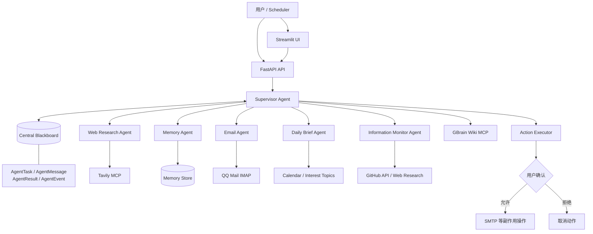
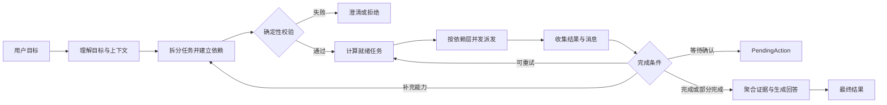
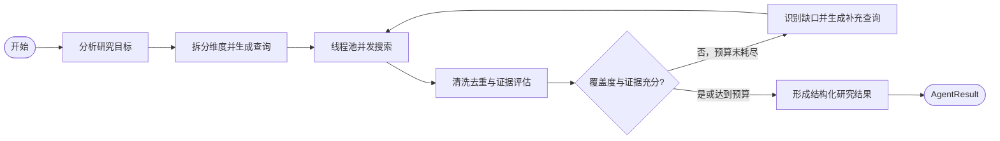
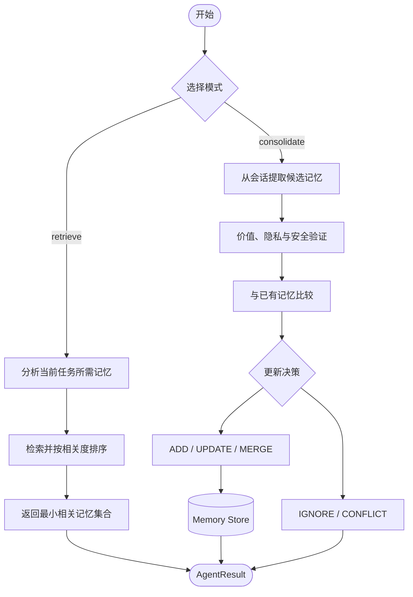
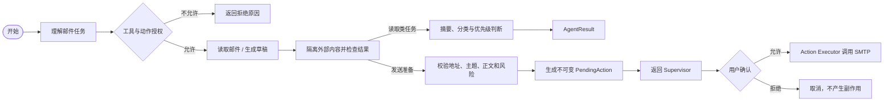
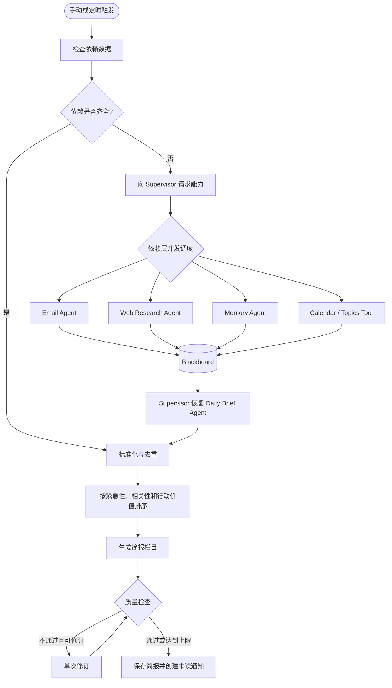
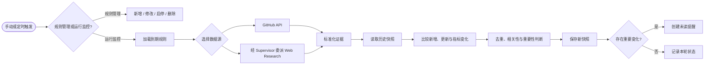
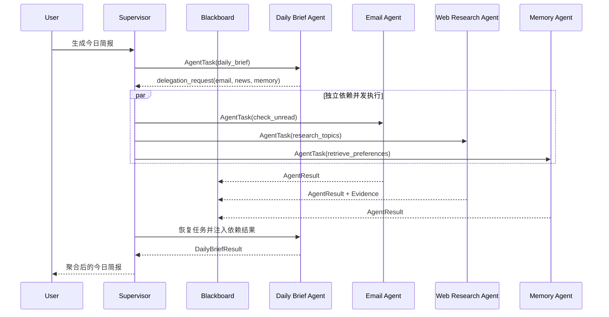

# PMAA 多 Agent 架构图

本文档对应当前实现，用于展示 Supervisor、中央 Blackboard 与 5 个子 Agent 的职责边界和内部 LangGraph 工作流。

## 1. 总体架构

系统采用中心化通信：子 Agent 只接收 Supervisor 创建的 `AgentTask`，通过 `AgentMessage` 请求补充能力，并以 `AgentResult` 返回结构化结果。子 Agent 之间不直接调用。

## 2. Supervisor 调度架构

Supervisor 负责全局目标、任务依赖、Agent 选择、并发、重试、权限校验和结果聚合；子 Agent 只维护自己的局部状态。

## 3. Agent 能力边界

| Agent | 独立目标 | 局部状态 | 可选工具/能力 | 结构化输出 |
|---|---|---|---|---|
| Web Research | 获取实时、可信、可引用的互联网证据 | 研究维度、查询、证据、覆盖度、迭代预算 | Tavily MCP | 研究结论、来源、缺口、冲突、置信度 |
| Memory | 检索并维护值得长期保存的用户信息 | 模式、相关记忆、候选记忆、验证与更新决策 | Memory Store | 最小相关记忆或写入结果 |
| Email | 理解邮件、分类、摘要、起草和生成发送计划 | 邮件请求、线程、风险、草稿、待确认动作 | QQ Mail IMAP、邮件草稿工具 | 分类、摘要、草稿、风险、PendingAction |
| Daily Brief | 生成个性化当日综合简报 | 邮件、新闻、日程、记忆、栏目、质量状态 | 经 Supervisor 请求其他能力 | 简报、缺失来源、质量检查结果 |
| Information Monitor | 持续跟踪指定目标并识别重要变化 | 规则、当前证据、历史快照、变化、提醒 | GitHub API、经 Supervisor 请求 Web Research | 变化、基线、快照、提醒、置信度 |

## 4. Web Research Agent

该 Agent 拥有独立系统提示词、研究状态和搜索预算。它不是单次搜索工具封装，而是可以根据证据缺口自主决定是否继续检索。

## 5. Memory Agent

密码、Token、一次性参数和普通闲聊由确定性规则阻止写入；LLM 负责语义提取和价值判断，但不能绕过安全校验。

## 6. Email Agent

Email Agent 不直接发送邮件。所有真实发送都由确定性的 Action Executor 执行，并使用用户确认过的不可变参数。

## 7. Daily Brief Agent

这里体现了跨 Agent 协作：Daily Brief Agent 只提出依赖请求，Supervisor 负责并发调度和结果回传。

## 8. Information Monitor Agent

首次运行只建立基线；抓取失败时保留旧快照，不能把“本次未抓到”误判为“内容已删除”。

## 9. 中心化通信示例

## 10. 组件边界

- **Agent**：具备独立目标、提示词、局部状态、推理步骤、工具权限和结果协议。
- **Tool / MCP**：执行确定性能力，本身不承担自主目标，例如 Tavily、GBrain、IMAP 和 GitHub API。
- **Supervisor**：创建任务、协调依赖、并发派发、处理委派请求并聚合结果。
- **Blackboard**：保存任务、消息、结果、证据和事件，不替代 Agent 推理。
- **Action Executor**：执行发送邮件等副作用动作，必须经过权限校验和用户确认。

更完整的字段定义、状态结构和验收标准见 [多 Agent 重构开发规格](MULTI_AGENT_DEVELOPMENT_SPEC_ZH.md)。
